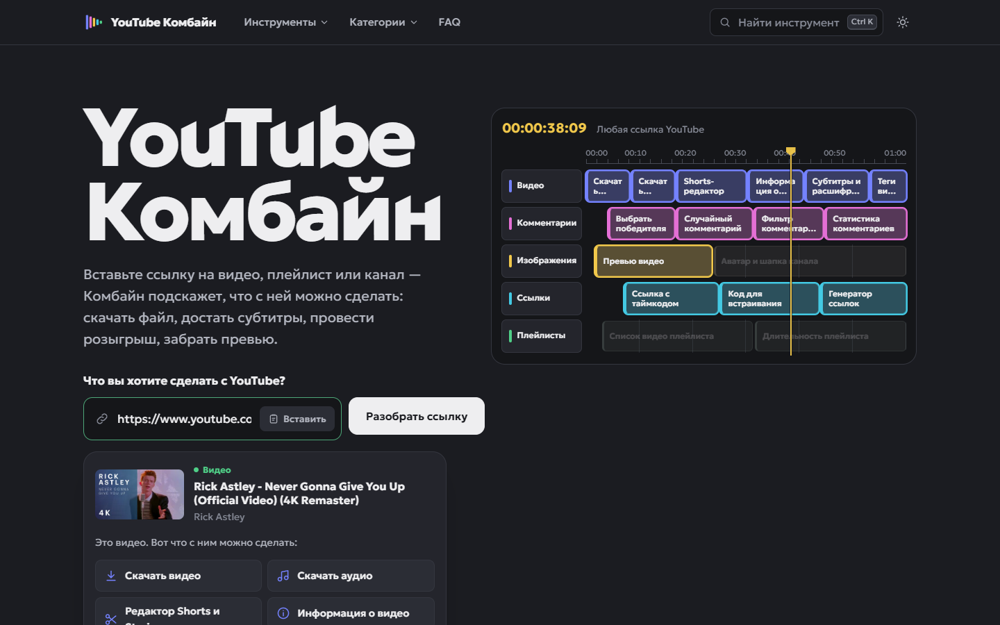
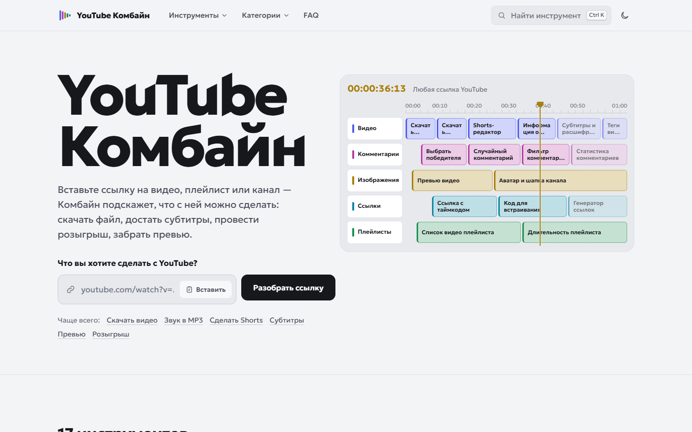
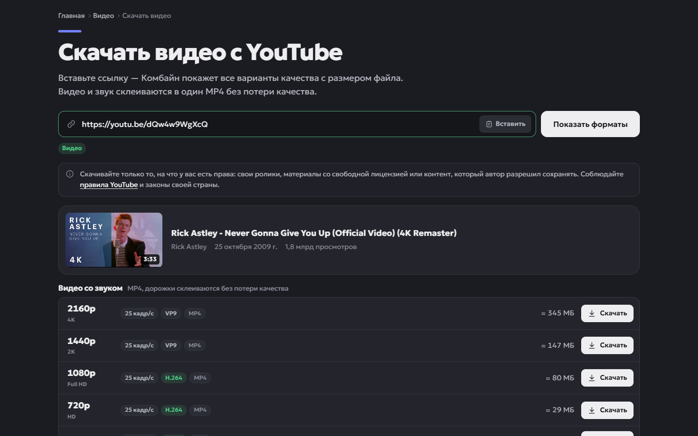
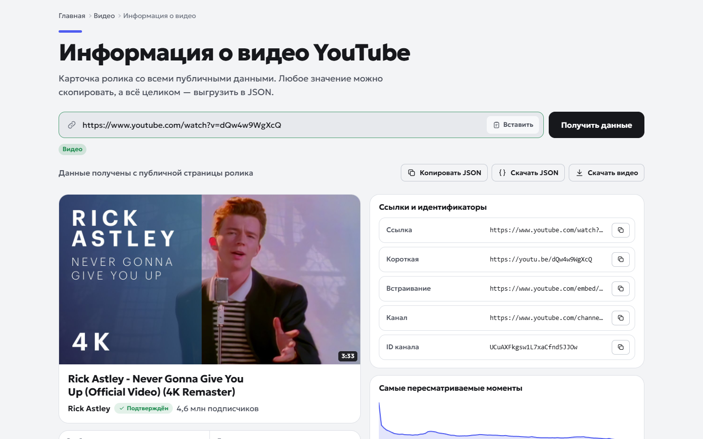
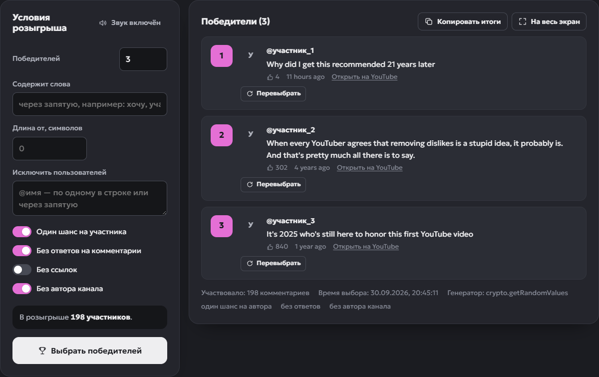
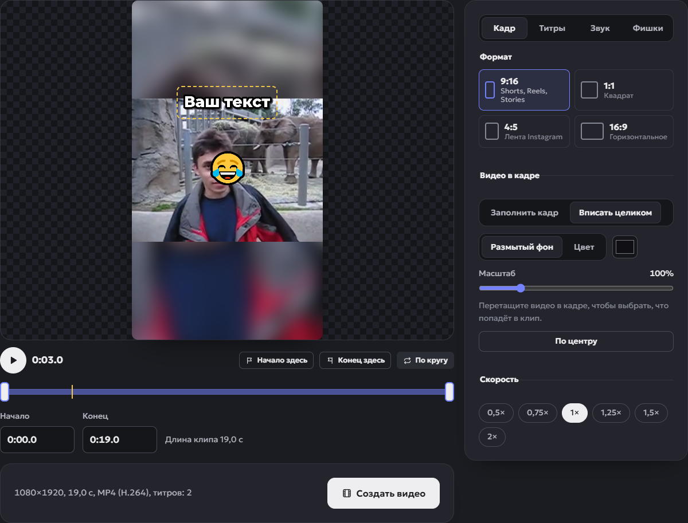
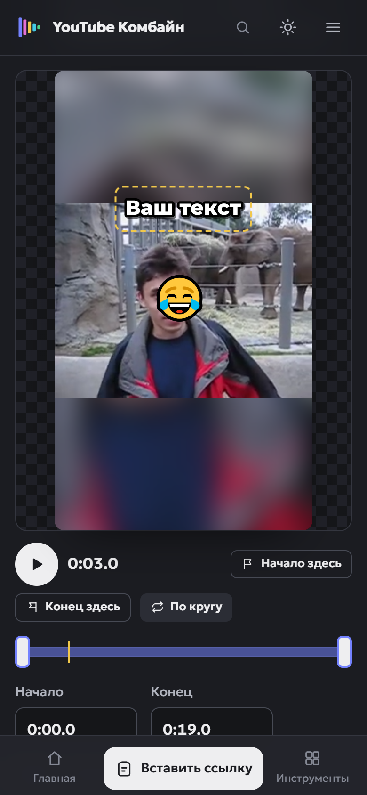

# YouTube Комбайн

17 бесплатных инструментов для YouTube в одном месте — скачивание, субтитры, розыгрыши, редактор Shorts — без API-ключей и регистрации.

**Сайт:** https://ytkombain.onrender.com


[](https://render.com/deploy?repo=https://github.com/OlegChe77/ytkombain)

Вставьте ссылку на видео, Shorts, плейлист или канал — Комбайн распознает её и предложит подходящие
инструменты: скачать видео и звук, достать субтитры и теги, провести розыгрыш в комментариях, собрать
вертикальный клип, выгрузить плейлист. Всё работает через [yt-dlp](https://github.com/yt-dlp/yt-dlp)
и публичные страницы, без YouTube Data API.

## Скриншоты

<table>
  <tr>
    <td width="50%"><br><sub>Главная: ссылка распознана, подходящие инструменты подсвечены</sub></td>
    <td width="50%"><br><sub>Светлая тема</sub></td>
  </tr>
  <tr>
    <td><br><sub>Скачать видео: все разрешения и размер файла заранее</sub></td>
    <td><br><sub>Информация о видео: данные, ссылки, пересматриваемые моменты</sub></td>
  </tr>
  <tr>
    <td><br><sub>Розыгрыш по комментариям: условия и несколько победителей</sub></td>
    <td><br><sub>Редактор Shorts: формат 9:16, титры, стикеры, размытый фон</sub></td>
  </tr>
  <tr>
    <td align="center"><br><sub>Телефон: главная</sub></td>
    <td align="center"><br><sub>Телефон: редактор Shorts</sub></td>
  </tr>
</table>

Скриншоты снимаются скриптом `scripts/screenshots.py` — см. [Картинки и скриншоты](#картинки-и-скриншоты).

## Что умеет

| Категория | Инструмент | Что делает |
|---|---|---|
| Видео | [Скачать видео](https://ytkombain.onrender.com/youtube-downloader) | MP4 до 4K/8K, выбор разрешения и FPS, размер заранее, прогресс, склейка дорожек |
| | [Скачать аудио](https://ytkombain.onrender.com/youtube-audio-downloader) | MP3 128/192 кбит/с, исходный M4A (AAC) или WebM (Opus) |
| | [Редактор Shorts и Stories](https://ytkombain.onrender.com/youtube-shorts-maker) | Отрезок, формат 9:16/1:1/4:5/16:9, титры со шрифтами и анимацией, эмодзи, субтитры из видео, своя музыка, скорость, размытый фон, полоса прогресса, обложка |
| | [Информация о видео](https://ytkombain.onrender.com/youtube-video-info) | Дата, длительность, просмотры, лайки, главы, теги, разрешения, пересматриваемые моменты, JSON |
| | [Субтитры и расшифровка](https://ytkombain.onrender.com/youtube-transcript) | Авторские, автоматические и переведённые субтитры, поиск, TXT/SRT/VTT |
| | [Теги видео](https://ytkombain.onrender.com/youtube-tags) | Скрытые теги, объём по правилам YouTube, хештеги |
| Комментарии | [Выбрать победителя](https://ytkombain.onrender.com/youtube-comment-picker) | Розыгрыш: несколько победителей, условия, барабан со звуком, фанфары и фейерверк, перевыбор, полноэкранный режим |
| | [Случайный комментарий](https://ytkombain.onrender.com/youtube-random-comment) | Одна кнопка RANDOM и история выборов |
| | [Фильтр комментариев](https://ytkombain.onrender.com/youtube-comment-filter) | Содержит/не содержит, длина, уникальные авторы, без ответов/ссылок, CSV/TXT |
| | [Статистика комментариев](https://ytkombain.onrender.com/youtube-comment-stats) | Авторы, частые слова, ответы, динамика по времени, отчёт в CSV |
| Изображения | [Превью видео](https://ytkombain.onrender.com/youtube-thumbnail) | Все размеры превью JPG/WebP, автокадры, проверка доступности |
| | [Аватар и шапка канала](https://ytkombain.onrender.com/youtube-channel-art) | Аватар и шапка в исходном размере, ID канала, RSS, ссылка на подписку |
| Ссылки | [Ссылка с таймкодом](https://ytkombain.onrender.com/youtube-timestamp) | Ссылка на момент видео, проверка глав для описания |
| | [Код для встраивания](https://ytkombain.onrender.com/youtube-embed) | Генератор iframe с живым превью |
| | [Генератор ссылок](https://ytkombain.onrender.com/youtube-link-generator) | youtu.be, подписка, RSS, «все загрузки», варианты для плейлистов |
| Плейлисты | [Список видео плейлиста](https://ytkombain.onrender.com/youtube-playlist) | Список видео плейлиста или канала, поиск, сортировка, TXT/CSV |
| | [Длительность плейлиста](https://ytkombain.onrender.com/youtube-playlist-length) | Длительность, диапазон видео, скорость 1–2×, план по дням |

Главная фишка — поле «Что вы хотите сделать с YouTube?» на главной и палитра поиска (`Ctrl+K`):
вставленная ссылка распознаётся (видео, Shorts, трансляция, плейлист, канал), и сайт сразу предлагает
подходящие инструменты. Ссылка передаётся между инструментами, её не нужно вставлять заново.

Каталог инструментов (адреса, Title, Description, FAQ) — `app/seo/catalog.py`. Концепция продукта,
визуальный язык и SEO-архитектура описаны в [docs/concept.md](docs/concept.md).

## Установка и локальный запуск

Нужны Python 3.11+ (в Docker-образе — 3.12) и (желательно) Node.js 20+ или Deno — как JS-движок для yt-dlp.

```bash
python -m venv .venv
```

Windows:

```bash
.venv\Scripts\pip install -r requirements.txt
```

```bash
.venv\Scripts\python -m uvicorn app.main:app --port 8000
```

Linux/macOS:

```bash
.venv/bin/pip install -r requirements.txt
```

```bash
.venv/bin/uvicorn app.main:app --port 8000
```

Откройте http://localhost:8000. Проверка окружения — http://localhost:8000/api/health:

```json
{"status": "ok", "yt_dlp": "2026.8.19", "ffmpeg": true, "js_runtime": "node"}
```

ffmpeg ставить отдельно не обязательно: если его нет в PATH, используется статическая сборка из пакета
`imageio-ffmpeg` (ставится из `requirements.txt`). Без ffmpeg работают только готовые форматы, без склейки и MP3.

Для разработки: правки шаблонов, CSS и JS подхватываются без перезапуска (версии файлов считаются по времени
изменения), после правок Python перезапустите uvicorn или добавьте `--reload`.

## Деплой на Render

Самый быстрый способ получить свою копию сайта — кнопка
[](https://render.com/deploy?repo=https://github.com/OlegChe77/ytkombain)
или вручную: **New → Blueprint** в панели Render → выберите репозиторий. Render прочитает `render.yaml`
из корня и создаст Docker-сервис **`ytkombain`**:

- сборка по `Dockerfile` (Python 3.12, ffmpeg и Deno уже внутри образа), порт берётся из `PORT`;
- проверка работоспособности — `/api/health`, автодеплой при каждом коммите в `main`;
- переменные окружения заданы в `render.yaml`:

| Переменная | Значение | Зачем |
|---|---|---|
| `SITE_URL` | `https://ytkombain.onrender.com` | canonical, sitemap, Open Graph. Для своей копии или домена укажите свой адрес |
| `APP_ENV` | `production` | Отключает `/api/docs` |
| `TRUST_PROXY` | `true` | Перед приложением на Render стоит прокси — без этого все посетители выглядят как один IP |

Там же — счётчики (`YANDEX_METRIKA_ID`, `HITS_COUNTER`, коды вебмастеров) и уменьшенные лимиты под бесплатный
тариф (`JOB_WORKERS`, `DOWNLOAD_WORKERS`, `MAX_FILESIZE_MB`, `EDITOR_MAX_SESSIONS`). Значения можно поменять
в `render.yaml` или в разделе **Environment** сервиса.

Что важно знать о Render:

- **План Free засыпает через 15 минут без посетителей.** Первый запрос после простоя будит сервис —
  страница открывается заметно дольше обычного. Задачи и временные файлы хранятся в памяти и на диске
  контейнера, поэтому при засыпании и каждом деплое они пропадают.
- **Ресурсов на Free мало**: склейка 4K и сборка клипов в редакторе Shorts идут медленно. Для постоянной
  нагрузки выберите платный план (`plan` в `render.yaml`).
- **YouTube ограничивает запросы с IP дата-центров**, в том числе облачных хостингов. Если на сайте появляется
  «YouTube временно ограничил запросы» или `Sign in to confirm you're not a bot` — см. [Troubleshooting](#troubleshooting).
- Свой домен подключается в **Settings → Custom Domains**; после этого обновите `SITE_URL`.

## Настройка

Все параметры — переменные окружения; локально удобнее всего скопировать `.env.example` в `.env`.

| Переменная | По умолчанию | Назначение |
|---|---|---|
| `SITE_URL` | `http://localhost:8000` | Публичный адрес — для canonical, sitemap, Open Graph |
| `APP_ENV` | `development` | `production` отключает `/api/docs` |
| `TRUST_PROXY` | `false` | Брать IP клиента из заголовков прокси (включайте только за своим прокси или на Render) |
| `YANDEX_METRIKA_ID` | `0` | Номер счётчика Яндекс Метрики; `0` — Метрика выключена |
| `YANDEX_VERIFICATION` | — | Код подтверждения Яндекс Вебмастера — значение атрибута `content` из метатега |
| `GOOGLE_VERIFICATION` | — | Код подтверждения Google Search Console — значение атрибута `content` из метатега |
| `HITS_COUNTER` | `false` | `true` — счётчик посещений [hits.sh](https://hits.sh) в подвале сайта |
| `TEMP_DIR` | системный TEMP/yt-kombain | Временные файлы скачивания |
| `FFMPEG_PATH` | авто | Путь к ffmpeg |
| `YTDLP_JS_RUNTIMES` | авто (deno, node, bun) | Например `deno` или `node:/usr/bin/node` |
| `YTDLP_COOKIES_FILE` | — | Cookies в формате Netscape, если YouTube требует вход |
| `POT_SERVER_DIR` | `/opt/pot` в Docker | Сервер PO-токенов [bgutil](https://github.com/Brainicism/bgutil-ytdlp-pot-provider): приложение запускает его на localhost:4416, статус — `pot_server` в `/api/health` |
| `YTDLP_PROXY` | — | Прокси для запросов к YouTube |
| `MAX_FILESIZE_MB` | 1024 | Максимальный размер файла |
| `MAX_DOWNLOAD_DURATION_MIN` | 240 | Максимальная длительность скачиваемого видео |
| `DOWNLOAD_TIMEOUT_S` | 900 | Таймаут подготовки файла |
| `FILE_TTL_S` | 900 | Сколько живёт неполученный файл |
| `MIN_FREE_DISK_MB` | 1024 | Резерв свободного места |
| `INFO_TIMEOUT_S` / `JOB_TIMEOUT_S` | 45 / 240 | Таймауты запросов и фоновых задач |
| `INFO_CONCURRENCY` | 6 | Одновременные запросы данных о видео к YouTube |
| `MAX_COMMENTS` / `MAX_PLAYLIST_ITEMS` | 5000 / 3000 | Верхние пределы загрузки |
| `JOB_WORKERS` / `DOWNLOAD_WORKERS` | 4 / 2 | Параллельные задачи |
| `MAX_QUEUED_JOBS` | 24 | Размер общей очереди задач |
| `EDITOR_MAX_SOURCE_MIN` | 30 | Максимальная длительность видео для редактора Shorts |
| `EDITOR_MAX_CLIP_S` | 180 | Максимальная длина готового клипа |
| `EDITOR_SESSION_TTL_S` | 3600 | Сколько хранится исходник без действий пользователя |
| `EDITOR_RENDER_TIMEOUT_S` / `EDITOR_RENDER_WORKERS` | 600 / 1 | Таймаут и параллельность сборки клипов (ffmpeg нагружает процессор) |
| `EDITOR_MAX_AUDIO_MB` / `EDITOR_MAX_SESSIONS` | 25 / 20 | Размер своей музыки и число одновременных сессий редактора |
| `RATE_API_PER_MIN` / `RATE_HEAVY_PER_MIN` / `RATE_DOWNLOAD_PER_HOUR` | 90 / 15 / 20 | Лимиты на IP |
| `MAX_JOBS_PER_IP` | 2 | Одновременные фоновые задачи с одного IP |

## Технологии

- **Backend:** Python 3.11+, FastAPI, uvicorn, yt-dlp (как библиотека, не через shell), httpx.
- **Frontend:** серверный рендеринг Jinja2 + ванильные ES-модули без сборщика и фреймворков.
  CSS собирается сервером в один файл с хешем в имени. Никаких сторонних JS-библиотек.
- **Медиа:** ffmpeg (системный или из пакета `imageio-ffmpeg`) для склейки и MP3;
  JS-движок (Deno, Node.js или Bun) — его требует yt-dlp для полноценной работы с YouTube.

## Структура

```
app/
  main.py              точка входа: middleware, обработка ошибок, фоновая очистка
  config.py            настройки из переменных окружения и .env
  core/                общая инфраструктура
    jobs.py            фоновые задачи с прогрессом и отменой
    ratelimit.py       лимиты запросов по IP
    security.py        CSP и заголовки безопасности, выборочное сжатие, HEAD
    cache.py           TTL-кэш в памяти
    errors.py          понятные тексты ошибок YouTube/yt-dlp
    assets.py          сборка CSS и версии статики
  youtube/             всё, что зависит от YouTube, — заменяемые модули
    urls.py            строгий разбор ссылок (белый список доменов, пересборка URL)
    ytdlp.py           единая точка настройки yt-dlp
    video.py           информация о видео и варианты скачивания
    comments.py        комментарии
    subtitles.py       субтитры (json3/vtt → фразы)
    playlist.py        плейлисты и вкладки каналов
    channel.py         данные канала
    media.py           oEmbed-превью и прокси картинок
  downloads/service.py скачивание во временную папку, отдача и удаление файлов
  editor/              редактор Shorts: render.py — сборка команды ffmpeg, service.py — сессии, музыка, рендер
  api/                 HTTP API
  seo/                 каталог инструментов (Title, Description, FAQ), мета-теги, JSON-LD
  web/pages.py         HTML-страницы, sitemap.xml, robots.txt, манифест
  templates/           Jinja2: base, partials, pages, tools
  static/
    css/               01-tokens … 06-tools (дизайн-система)
    js/core/           DOM, API, форматирование, разбор ссылок, UI-компоненты, графики
    js/comments/       общая загрузка и фильтрация комментариев
    js/editor/         редактор Shorts: состояние, превью, таймлайн, панели, экспорт
    js/tools/          по модулю на инструмент
    img/               иконки, SVG-спрайт, OG-картинки
scripts/
  generate_images.py   генерация favicon, PWA-иконок и OG-картинок
  screenshots.py       скриншоты для README (Playwright + системный Edge)
tests/                 pytest: ссылки, SEO каждой страницы, битые ссылки, безопасность API, форматы
deploy/                nginx, systemd, скрипт обновления yt-dlp
docs/
  concept.md           концепция и дизайн-решения
  screenshots/         скриншоты для README
render.yaml            Blueprint для Render
Dockerfile             образ с Python, ffmpeg и Deno
```

## API

| Метод | Путь | Назначение |
|---|---|---|
| GET | `/api/health` | Версия yt-dlp, наличие ffmpeg и JS-движка |
| GET | `/api/catalog` | Каталог инструментов для поиска |
| GET | `/api/preview?url=` | Быстрое название/автор через oEmbed |
| POST | `/api/video/info` | Данные видео и варианты скачивания |
| POST | `/api/transcript` | Фразы выбранной дорожки субтитров |
| POST | `/api/channel` | Данные канала |
| POST | `/api/comments` | Фоновая задача загрузки комментариев |
| POST | `/api/playlist` | Фоновая задача загрузки списка |
| POST | `/api/download` | Фоновая задача подготовки файла |
| GET / DELETE | `/api/jobs/{id}` | Статус и прогресс задачи / отмена |
| GET | `/api/download/{id}/file` | Готовый файл (удаляется после отдачи) |
| GET | `/api/thumbnail/{id}/{name}` | Превью как файл |
| POST | `/api/editor/source` | Фоновая задача: видео для редактора (до 720p) |
| GET | `/api/editor/{session}/source` | Исходник для превью (с поддержкой перемотки) |
| POST / DELETE | `/api/editor/{session}/audio` | Загрузить (тело — сам файл) / убрать свою музыку |
| POST | `/api/editor/{session}/render` | Фоновая задача сборки клипа; титры передаются готовыми PNG |
| GET | `/api/editor/render/{id}/file` | Готовый клип (удаляется после отдачи) |
| GET | `/api/image?src=&name=` | Картинка с доменов YouTube как файл |

Ошибки всегда в формате `{"error": {"code", "message", "hint"}}` с понятным текстом на русском.
Интерактивная документация — `/api/docs` (только при `APP_ENV=development`).

## Безопасность и защита ресурсов

- Строгая проверка ссылок: только домены YouTube, без логина/порта, длина ≤ 2048. В yt-dlp уходит ссылка,
  собранная заново из проверенных ID, — пользовательская строка туда не попадает.
- yt-dlp вызывается как библиотека, без shell. Формат скачивания выбирается только из списка, который сервер
  сам построил для этого видео; произвольные строки формата отклоняются.
- Прокси картинок работает только с `i.ytimg.com`, `yt3.ggpht.com`, `yt3.googleusercontent.com`,
  без редиректов, с проверкой типа и размера (защита от SSRF).
- Лимиты: запросы в минуту, тяжёлые операции, скачивания в час, одновременные задачи на IP, общая очередь.
- Таймауты на каждом этапе; задачи можно отменить; прерывание срабатывает внутри хуков yt-dlp.
- Файлы: лимит размера (заранее и во время скачивания), лимит длительности, проверка свободного места,
  удаление через 30 секунд после отдачи и по TTL, очистка забытых папок при старте.
- CSP без `unsafe-inline` для скриптов, `frame-ancestors 'none'`, nosniff, Referrer-Policy, Permissions-Policy.
- Пользовательские данные на странице выводятся только как текст; CSV защищён от формул Excel.
- Редактор Shorts: текст титров рисуется в браузере и приходит готовыми PNG (проверяются сигнатура и размер),
  поэтому в граф фильтров ffmpeg не попадает ни одна пользовательская строка — только числа и проверенные цвета.
  Музыка проверяется декодированием через ffmpeg. Размер тел запросов ограничен: 64 КБ для API,
  25 МБ для музыки, 24 МБ для титров. Сборка идёт в отдельной очереди с таймаутом и ограничением потоков.

## Production на Linux (VPS)

Подойдёт любой VPS от 1 vCPU / 1 ГБ RAM. Приложение работает **одним процессом** (задачи и лимиты в памяти),
параллельность — потоками внутри него.

```bash
sudo apt update && sudo apt install -y python3-venv ffmpeg nginx
```

```bash
curl -fsSL https://deno.land/install.sh | sudo DENO_INSTALL=/usr/local sh
```

```bash
sudo useradd --system --create-home --home-dir /srv/kombain kombain
```

Скопируйте проект в `/srv/kombain`, затем:

```bash
cd /srv/kombain && sudo -u kombain python3 -m venv .venv && sudo -u kombain .venv/bin/pip install -r requirements.txt
```

```bash
sudo cp .env.example .env && sudo nano .env
```

В `.env` укажите `SITE_URL=https://ваш-домен`, `APP_ENV=production`, `TRUST_PROXY=true`.

```bash
sudo mkdir -p /var/tmp/yt-kombain && sudo chown kombain /var/tmp/yt-kombain
```

```bash
sudo cp deploy/yt-kombain.service /etc/systemd/system/ && sudo systemctl daemon-reload && sudo systemctl enable --now yt-kombain
```

```bash
sudo cp deploy/nginx.conf /etc/nginx/sites-available/yt-kombain && sudo ln -s /etc/nginx/sites-available/yt-kombain /etc/nginx/sites-enabled/
```

Замените `example.com` на свой домен, выпустите сертификат и перезагрузите nginx:

```bash
sudo certbot --nginx -d ваш-домен && sudo nginx -t && sudo systemctl reload nginx
```

### Docker

```bash
docker compose up -d --build
```

Контейнер слушает `127.0.0.1:8000`; поставьте перед ним nginx из `deploy/nginx.conf`. Образ уже содержит
ffmpeg и Deno, файловая система только для чтения, временные файлы — в tmpfs на 4 ГБ.

### Другие хостинги

Нужен сервер, где можно запускать процессы и писать во временную папку: VPS, Oracle Cloud Free Tier,
Fly.io, Railway, [Render](#деплой-на-render) (Docker). Статические хостинги и serverless-функции
(Vercel, Netlify) не подходят: скачивание требует долгих процессов, ffmpeg и диска.

## Обновление yt-dlp

YouTube регулярно меняет сайт, и yt-dlp выпускает исправления. Обновляйте раз в неделю или сразу при
массовых ошибках «Не получилось обработать ссылку»:

```bash
/srv/kombain/.venv/bin/pip install -U "yt-dlp[default]" && sudo systemctl restart yt-kombain
```

Готовый скрипт для cron — `deploy/update-ytdlp.sh`. В Docker — пересоберите образ: `docker compose build --pull && docker compose up -d`.
На Render — **Manual Deploy → Clear build cache & deploy**.

Если что-то сломалось из-за изменений YouTube, правки локализованы в `app/youtube/`: разбор ссылок, настройки
yt-dlp, нормализация видео, комментариев, субтитров и плейлистов — отдельные модули с понятным интерфейсом.

## Картинки и скриншоты

Favicon, иконки PWA и OG-картинки для каждой страницы уже лежат в `app/static/img`. После изменения каталога
инструментов перегенерируйте их:

```bash
.venv/bin/pip install -r requirements-dev.txt && .venv/bin/python scripts/generate_images.py
```

Скриншоты для README снимает `scripts/screenshots.py` через Playwright. Браузеры Playwright скачивать
не нужно — используется установленный Microsoft Edge (`BROWSER_CHANNEL=chrome` — Google Chrome).
Запустите сайт локально и выполните:

```bash
.venv/bin/python scripts/screenshots.py
```

Отдельные кадры — по именам: `scripts/screenshots.py downloader comment-picker`. Адрес сайта задаёт `BASE_URL`
(по умолчанию `http://localhost:8000`), `HEADLESS=0` показывает окно браузера. Данные берутся с живого YouTube,
файлы тяжелее ~700 КБ автоматически пережимаются в JPG.

## Тесты

```bash
.venv/bin/python -m pytest
```

Проверяются: разбор ссылок и отказ на вредоносных, SEO каждой страницы (один H1, Title, Description,
canonical, Open Graph, валидный JSON-LD), уникальность заголовков, отсутствие битых внутренних ссылок,
sitemap/robots/manifest, валидация API и защита прокси картинок, построение вариантов скачивания.

## Troubleshooting

| Симптом | Причина и решение |
|---|---|
| «YouTube временно ограничил запросы» / `Sign in to confirm you're not a bot` | IP сервера попал под защиту YouTube (часто у дата-центров и облачных хостингов, включая Render). Обновите yt-dlp, подождите; при повторении — укажите `YTDLP_PROXY` (резидентный прокси) или `YTDLP_COOKIES_FILE` с cookies отдельного аккаунта. |
| Сайт на Render долго открывается после паузы | План Free засыпает через 15 минут простоя, первый запрос будит сервис. На платном плане сервис не засыпает. |
| На Render пропали задача, файл или сессия редактора | Сервис заснул или перезапустился после деплоя — состояние хранится в памяти контейнера. Повторите действие. |
| Мало форматов, нет 1080p+ | Не найден JS-движок. Проверьте `js_runtime` в `/api/health`, установите Deno или Node.js 20+ либо задайте `YTDLP_JS_RUNTIMES`. |
| Нет MP3 и видео выше 360p | Нет ffmpeg: `ffmpeg` в `/api/health` равно `false`. Установите ffmpeg или пакет `imageio-ffmpeg`. |
| «Выбранный формат больше недоступен» | Ссылки на файлы YouTube живут ограниченное время. Нажмите «Показать форматы» ещё раз. |
| Субтитры: ошибка 429 | YouTube ограничил частоту запросов к субтитрам. Повторите через минуту. |
| Файл не скачивается, 410 | Файл уже отдан и удалён. Нажмите «Подготовить заново». |
| Все пользователи получают «Слишком много запросов» | За прокси не включён `TRUST_PROXY=true` — все запросы выглядят как один IP. |
| `Сервер сейчас загружен` | Заполнена очередь задач. Увеличьте `JOB_WORKERS`/`MAX_QUEUED_JOBS`, если позволяют ресурсы. |
| Большие видео обрываются за nginx | Проверьте `proxy_read_timeout` и `proxy_buffering off` для `/api/download/`. |
| Задачи «теряются» | Запущено несколько воркеров uvicorn. Запускайте один процесс — состояние хранится в памяти. |
| Редактор: «Слишком большой запрос» при загрузке музыки | За nginx не поднят `client_max_body_size` для `/api/editor/` — возьмите блок из `deploy/nginx.conf`. |
| Редактор долго собирает клип | Сборка 1080×1920 грузит процессор. На слабом VPS и Render Free оставьте `EDITOR_RENDER_WORKERS=1`, клипы ставятся в очередь. |

## Правовая информация

Комбайн — независимый сервис, не связанный с YouTube и Google LLC. Пользователь отвечает за соблюдение
Условий использования YouTube, авторских прав и законов своей страны. Скачивайте только тот контент,
на который у вас есть права.

## Другие проекты автора

- [Растр](https://rastr.onrender.com) — конвертер и сжатие изображений прямо в браузере.
- [SEO Toolkit](https://seotoolkitru.onrender.com) — бесплатные SEO-инструменты.
